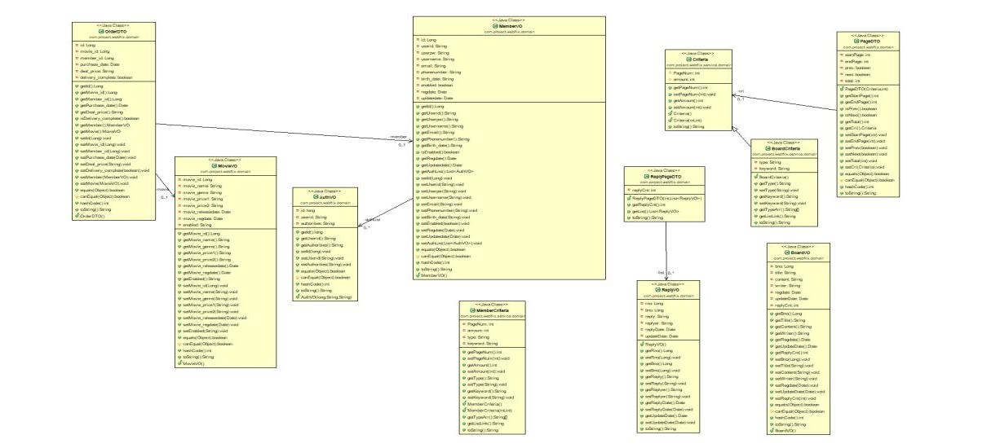

# WebFlix

> SpringFramework MVC 기반 프로젝트

> [master branch](https://github.com/julyfirst/webflix) - spring 프레임워크, java, ajax, jsp, bootstarp, Oracle/Mybatis 를 이용해 구현한 WebFlix(영화구매사이트)!

## :memo: Description

Web_Flix는 **웹(Web)과 영화(flicks)를 합성어로 웹 페이지에서 영화를 구매하여 볼 수 있는 사이트** 입니다.
```
1. 코로나19로 인해 집에있는 사람들을 위한 
2. 여러가지 장르의  손쉽게 다운 받을 수 있게

웹플릭스는 다양한 장르(액션, 멜로, 공포, 에니메이션)등 영화 정보(줄거리, 예고편, 출연진)을 볼 수 
있고 다운로드버튼을 클릭하여 해당영화를 다운을 받을 수 있습니다.
```
## :desktop_computer: DataBase(Oracle) 
**ERD**


**Class-Diagram**



## :gear: Function

**보안(Security)**
```
- Spring Web Security를 이용한 로그인, 자동로그인(세션유지), 접근제한설정, csrf 공격방지
```
**계정**
```
- 계정 관한은 "ROLE_ADMIN"(관리자), "ROLE_MEMBER"(회원) 이 있습니다.
- 회원가입시 스프링 시큐리티에서 제공하는 PasswordEncoder(sha256 + salt) 를 이용하여 
  비밀번호를 암호화를 하였습니다.
```
**ID / PW 찾기**
```
-  아이디를 찾고 싶을 땐 가입했던 이메일을 입력하여 아이디를 찾을 수 있습니다.
-  비밀번호 찾기시 복호화가 불가능 하므로 가입된 이메일과 아이디를 입력하면 새로운 비밀번호를 네이버 smtp를
   이용하여 새로운 비밀번호를 발송합니다.
```
**영화상세페이지**
```
- 해당영화를 구매할 수 있고, 다운로드 버튼을 누르면 해당영화가 다운로드가 됩니다.
```

**마이페이지**
```
- 로그인된 한 사용자는 자신이 구매한 영화 목록을 볼 수 있습니다.
```
**회원정보**
```
- 관리자권한("ROLE_ADMIN")을 가진사람이 웹플릭스 홈페이지에 가입된 회원정보
  (이름, 생년월일, 가입날짜, 핸드폰번호 등)를 볼 수 있습니다.
```
**게시판**
```
- 모든 사용자는 게시물을 읽을 수 있고, 로그인 한 사용자는 게시물 작성하고 
  자신의 게시물에 대해 수정 삭제 할 수 있습니다.
```
**댓글**
```
- 댓글은 REST 방식으로 Ajax를 이용하여 처리하였습니다.
- 모든 사용자는 게시물에 쓰여진 댓글을 읽을 수 있고, 로그인 한 사용자는 댓글 작성하고 
  자신의 댓글에 대해 수정 삭제 할 수 있습니다.
```
